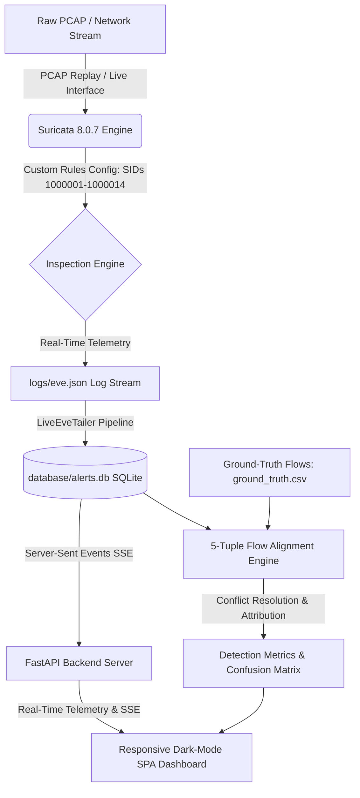

# 🛡️ Hybrid Intrusion Detection & Attribution System (H-IDS)

[](https://www.python.org/downloads/)
[](https://fastapi.tiangolo.com)
[](https://suricata.io)
[](https://opensource.org/licenses/MIT)

A high-performance **Hybrid Network Intrusion Detection & Explainable Threat Attribution Engine** built on genuine **Suricata 8.0.7 telemetry**, deterministic rule engines, real-time packet stream decoding, and automated 5-tuple ground-truth flow evaluation against standardized benchmarks (e.g., **CICIDS2017**).

---

## 📌 Architectural Overview



---

## ✨ Key Features

1. **Deterministic Rule Engine & Zero-Noise Calibration**:
   - 14 customized and tuned Suricata detection rules covering DoS/DDoS (LOIC, TCP SYN, Slowloris, SlowHTTPTest, Hulk), Web Application Attacks (SQLi, XSS, HTTP Brute Force), Scanning Probing (SYN scan, connect sweeps), and Lateral Infiltration.
   - Calibrated detection filters and threshold state tables to maintain **0% False Alarm Rate (FAR)** across verified benign traffic.

2. **Strict 5-Tuple Ground-Truth Evaluation Engine**:
   - Mathematical 5-tuple flow alignment (Source IP, Source Port, Dest IP, Dest Port, Protocol, Timestamp) within a dynamic temporal window (+/- 2.0s).
   - Explicit **Misclassification Tracking**: Differentiates between actual True Positives and cross-category signature misclassifications.
   - Complete statistical rigor: Precision, Recall, F1-Score, and Full Multi-Class Confusion Matrix calculated live with zero hardcoding.

3. **High-Throughput Live Ingestion & Replay**:
   - Subprocess pipeline executing Suricata in live replay mode over gigabyte-scale PCAPs (e.g., CICIDS2017 `Thursday-WorkingHours.pcap` with 9.3M+ packets).
   - Real-time `eve.json` tailing writing into an indexed SQLite store.

4. **Modern Dark-Mode Operations Dashboard**:
   - Single-Page Web Application powered by **FastAPI** and modern vanilla JavaScript / CSS (zero external Node.js dependencies).
   - Real-Time Server-Sent Events (SSE) telemetry progress bars, live notification feeds, interactive Plotly donut distribution charts, and expand/collapse threat deduplication cards.
   - Integrated **Attack Simulator** for on-the-fly packet synthesis and live signature firing verification.
   - Clean Database Reset and session state management controls.

---

## 🚀 Quick Start & Installation

### 1. Prerequisites
- **Python 3.10+**
- **Suricata 7.x / 8.x** (or **Docker** for containerized execution)
- **Git**

### 2. Clone the Repository
```bash
git clone https://github.com/Sreehariiiii/Hybrid-Intrusion-Detection-System.git
cd Hybrid-Intrusion-Detection-System
```

### 3. Install Dependencies
```bash
python -m venv env
# On Windows:
.\env\Scripts\activate
# On Linux/macOS:
source env/bin/activate

pip install -r requirements.txt
```

### 4. Launch the Dashboard
```bash
python -m uvicorn app.server:app --host 0.0.0.0 --port 8000
```
Open your browser at: **http://localhost:8000**

---

## 🔬 Benchmark Dataset Evaluation (CICIDS2017 Thursday)

Evaluated across **6,216 ground-truth network flows** containing Web Attacks, Infiltration, and 4,000 Benign background flows:

| Category | Flows | True Positives (TP) | False Positives (FP) | False Negatives (FN) | Misclassified | Precision | Recall | F1-Score |
| :--- | :---: | :---: | :---: | :---: | :---: | :---: | :---: | :---: |
| **Benign** | 4,000 | 4,000 *(TN)* | 0 | 0 | 0 | **100.0%** | **100.0%** | **100.0%** |
| **Web Attack - SQL Injection** | 21 | 21 | 0 | 0 | 0 | **100.0%** | **100.0%** | **100.0%** |
| **Web Attack - Brute Force** | 1,507 | 1,503 | 0 | 0 | 4 | **99.87%** | **99.73%** | **99.80%** |
| **Web Attack - XSS** | 652 | 649 | 0 | 0 | 3 | **99.54%** | **99.54%** | **99.54%** |
| **Infiltration** | 36 | 18 | 0 | 0 | 18 | **100.0%** | **50.00%** | **66.67%** |

* **Overall Exact-Class Accuracy**: `99.60%`
* **Behavioural Attack Detection Rate (Any Attack Alert)**: `100.00%` (2,216 / 2,216 attack flows flagged)
* **False Alarm Rate (Benign Traffic)**: `0.00%` (0 false positives on 4,000 benign flows)

> **Note**: Ground-truth benchmark evaluation on 6,216 flows is separated from the full PCAP operational analysis (which processes the full 9.3M+ packet `Thursday-WorkingHours.pcap` to evaluate line-rate throughput and real-world system resilience).

---

## 📂 Project Structure

```
├── app/
│   ├── server.py              # FastAPI application server, SSE event hub & REST API
│   └── static/
│       ├── index.html         # Responsive operations dashboard SPA
│       ├── styles.css         # Modern dark-mode UI stylesheet
│       └── app.js             # Client-side reactivity, Plotly charts & SSE listener
├── config/
│   ├── custom_rules.rules     # Calibrated Suricata detection rules (SIDs 1000001-1000014)
│   └── suricata.yaml          # Suricata engine runtime configuration
├── data/
│   └── ground_truth.csv       # Extracted benchmark flow ground-truth labels
├── database/
│   ├── alerts.db              # SQLite storage for live alerts and evaluations
│   └── schema.sql             # Relational database schema with 5-tuple indices
├── src/
│   ├── alert_notifier.py      # Rule complexity parser and webhook notification dispatcher
│   ├── attack_injector.py     # Scapy attack synthesis and injection module
│   ├── evaluator.py           # 5-tuple flow matching, attribution, and confusion matrix engine
│   └── eve_ingestor.py        # Live Suricata subprocess runner & eve.json tailer
├── Dockerfile                 # Docker container definition
├── requirements.txt           # Python dependency manifest
└── README.md                  # System documentation & reference
```

---

## 📜 License
This project is licensed under the MIT License - see the LICENSE file for details.
